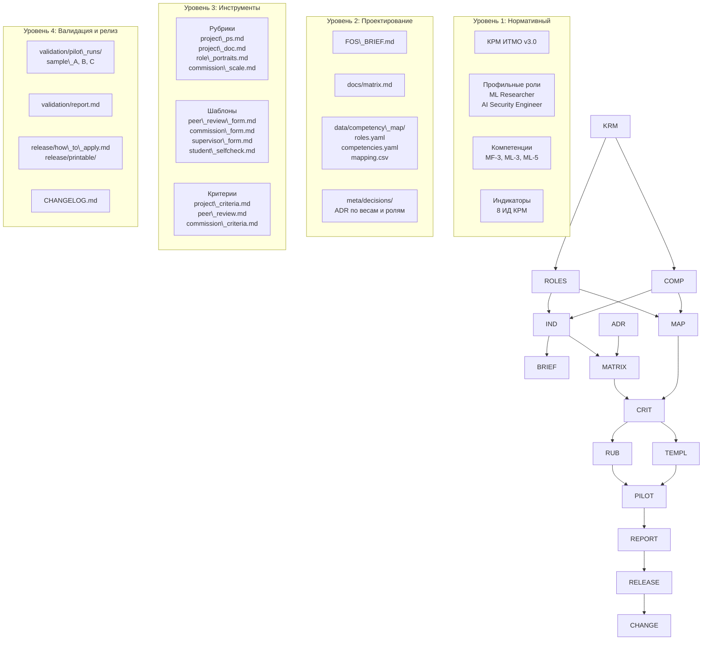
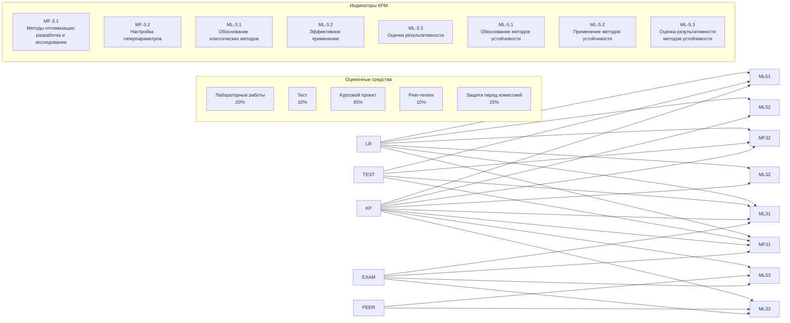
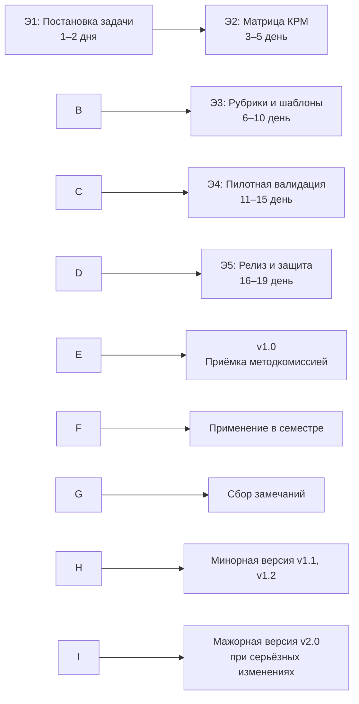

\# Архитектура фонда оценочных средств (ФОС)

\*\*Дисциплина:\*\* Методы оптимизации в системах искусственного интеллекта  
\*\*Направление:\*\* 09.03.04 Программная инженерия, 6 семестр  
\*\*Версия ФОС:\*\* v1.0 (2026)  
\*\*Модель компетенций:\*\* КРМ ИТМО v3.0

---

## 1. Назначение документа

Настоящий документ описывает архитектуру фонда оценочных средств (ФОС) 
проектной работы дисциплины «Методы оптимизации в системах искусственного 
интеллекта». Документ предназначен для:

- \*\*преподавателей-пользователей ФОС\*\* — как руководство по применению;
- \*\*методической комиссии ОП\*\* — для приёмки и аудита;
- \*\*разработчиков смежных ФОС\*\* — как референс по структуре;
- \*\*студентов\*\* — для понимания логики оценивания.

Архитектура ФОС построена по принципу \*\*зеркальности\*\* относительно 
студенческой интеллектуальной информационной системы (ИИС): разработчик 
проходит те же этапы, что и студент при создании ИИС — от постановки задачи 
до валидации и релиза.

---

## 2. Цели и задачи ФОС

### 2.1. Цель

Обеспечить объективное, полное и воспроизводимое оценивание уровня 
сформированности профессиональных компетенций студентов по КРМ ИТМО для 
профильных ролей:

- \*\*ML Researcher\*\* (Исследователь машинного обучения)
- \*\*AI Security Engineer\*\* (Инженер безопасности ИИ)

### 2.2. Задачи

1. Соотнести содержание проектной работы дисциплины с профессиональными 
   ролями и индикаторами КРМ.
2. Обеспечить триангуляцию оценки: каждый индикатор оценивается ≥ 2 средствами.
3. Разработать 10-балльные рубрики по двум осям: «Программное решение (MVP)» 
   и «Документация».
4. Подготовить шаблоны оценочных средств (peer-review, комиссия, руководитель).
5. Провести пилотную валидацию на реальных работах прошлых лет.
6. Обеспечить воспроизводимость: любой преподаватель должен уметь применить 
   ФОС без личных консультаций с разработчиком.

---

## 3. Архитектурные уровни

ФОС построен на четырёх уровнях абстракции:

```

┌─────────────────────────────────────────────────────────────────┐
│  УРОВЕНЬ 1: НОРМАТИВНЫЙ (КРМ ИТМО v3.0)                       │
│  ─────────────────────────────────────────────────────────────  │
│  • Профессиональные роли: ML Researcher, AI Security Engineer   │
│  • Компетенции: MF-3, ML-3, ML-5                                │
│  • Индикаторы достижения: MF-3.1, MF-3.2, ML-3.1, ML-3.2,      │
│    ML-3.3, ML-5.1, ML-5.2, ML-5.3                               │
│  • Уровни сформированности: базовый / средний / продвинутый     │
└─────────────────────────────────────────────────────────────────┘
│
▼
┌─────────────────────────────────────────────────────────────────┐
│  УРОВЕНЬ 2: ПРОЕКТИРОВАНИЕ (mapping)                            │
│  ─────────────────────────────────────────────────────────────  │
│  • roles.yaml, competencies.yaml, mapping.csv                   │
│  • Матрица «Роль × Компетенция × Индикатор × Оценочное средство»│
│  • Веса оценочных средств, пороги освоения                      │
│  • ADR по методическим решениям                                 │
└─────────────────────────────────────────────────────────────────┘
│
▼
┌─────────────────────────────────────────────────────────────────┐
│  УРОВЕНЬ 3: ИНСТРУМЕНТЫ ОЦЕНИВАНИЯ                              │
│  ─────────────────────────────────────────────────────────────  │
│  • Рубрики (10-балльные шкалы по осям MVP и Документация)       │
│  • Шаблоны (peer-review, комиссия, руководитель, самопроверка)  │
│  • Оценочные средства: ЛР, тест, КП, защита, peer-review        │
└─────────────────────────────────────────────────────────────────┘
│
▼
┌─────────────────────────────────────────────────────────────────┐
│  УРОВЕНЬ 4: ВАЛИДАЦИЯ И РЕЛИЗ                                   │
│  ─────────────────────────────────────────────────────────────  │
│  • Пилотные прогоны (sample\_A, sample\_B, sample\_C)              │
│  • Отчёт валидации, калибровка порогов                          │
│  • Инструкция для преподавателя-пользователя                    │
│  • Печатные формы (PDF)                                         │
└─────────────────────────────────────────────────────────────────┘

```

---

## 4. Диаграмма компонентов ФОС



\---

## 5\. Потоки оценивания

ФОС обеспечивает формирование и оценку индикаторов КРМ через пять
оценочных средств. Каждый индикатор оценивается минимум двумя средствами
(принцип триангуляции).



### 5.1. Матрица покрытия индикаторов

|Индикатор|ЛР|Тест|КП|Peer-review|Защита|Покрытие|
|-|:-:|:-:|:-:|:-:|:-:|:-:|
|**MF-3.1**|●|●|●||●|4|
|**MF-3.2**|●|●|●|||3|
|**ML-3.1**|●|●|●||●|4|
|**ML-3.2**|●||●|||2|
|**ML-3.3**|||●|●|●|3|
|**ML-5.1**|●|●|●|||3|
|**ML-5.2**|●||●|||2|
|**ML-5.3**|||●|●|●|3|

**Все 8 индикаторов покрыты ≥ 2 средствами.** Минимальное покрытие — 2
(индикаторы ML-3.2 и ML-5.2), максимальное — 4 (MF-3.1 и ML-3.1).

\---

## 6\. Зеркальная структура: ИИС ↔ ФОС

ФОС оформляется как программный продукт: разработчик проходит те же этапы,
что и студент при создании ИИС. Каждой типовой директории репозитория ИИС
соответствует свой аналог в репозитории ФОС.

|Артефакт ИИС|Артефакт ФОС|Смысл зеркальности|
|-|-|-|
|`README.md`|`README.md`|Корневое описание проекта / фонда, назначение, целевая аудитория, быстрый старт|
|`PROJECT\_BRIEF.md`|`FOS\_BRIEF.md`|Постановка задачи ИИС ↔ постановка задачи ФОС (какая дисциплина, какие роли КРМ)|
|`docs/architecture.md`|`docs/fos\_architecture.md`|Архитектура ИИС ↔ архитектура ФОС (структура средств, связь с индикаторами КРМ)|
|`data/`|`data/competency\_map/`|Данные для системы ↔ выгрузка компетенций и индикаторов КРМ, привязка к ролям|
|`src/models/`|`src/rubrics/`|Модели ИИС ↔ рубрики оценивания (10-балльные шкалы по осям)|
|`src/api/`|`src/templates/`|API / интерфейсы системы ↔ шаблоны оценочных средств|
|`tests/`|`tests/`|Тесты ИИС ↔ авто- и ручные тесты валидности ФОС|
|`experiments/`|`validation/`|Эксперименты ↔ пилотное применение ФОС|
|`deployment/`|`release/`|Развёртывание ↔ инструкция по внедрению ФОС в учебный процесс|
|`CHANGELOG.md`|`CHANGELOG.md`|Журнал изменений — обязателен для обеих сторон|
|`LICENSE`|`LICENSE`|Лицензия — по умолчанию для внутриуниверситетского использования|

\---

## 7\. Структура репозитория ФОС

```
fos-МОИИ/
│
├── 📄 README.md                        # быстрый старт, назначение, целевая аудитория
├── 📄 FOS\_BRIEF.md                     # постановка «задачи ФОС»
├── 📄 LICENSE                          # лицензия для внутриуниверситетского использования
├── 📄 CHANGELOG.md                     # версии ФОС по семестрам/курсов
│
├── 📁 meta/                            # метаданные и методические решения
│   ├── 📄 inputs.md                    # входные данные (ВХ-1 — ВХ-7)
│   ├── 📄 roles\_scope.md               # обоснование выбора ролей КРМ
│   └── 📁 decisions/                   # ADR по методическим решениям
│       ├── 📄 0001-choice-of-roles.md  # ADR по выбору ролей
│       └── 📄 0002-axes-and-weights.md # ADR по осям и весам
│
├── 📁 docs/                            # документация ФОС
│   ├── 📄 fos\_architecture.md          # архитектура ФОС (настоящий документ)
│   ├── 📄 passport.md                  # паспорт ФОС
│   ├── 📄 matrix.md                    # матрица компетенций × оценочные средства
│   ├── 📄 project\_criteria.md          # критерии оценивания курсового проекта
│   ├── 📄 peer\_review.md               # регламент peer-review
│   ├── 📄 commission\_criteria.md       # критерии оценки защиты перед комиссией
│   └── 📁 diagrams/                    # PlantUML/Mermaid схемы
│
├── 📁 data/                            # машиночитаемые данные
│   └── 📁 competency\_map/
│       ├── 📄 roles.yaml               # выбранные ИИ-роли и индикаторы КРМ
│       ├── 📄 competencies.yaml        # компетенции с ИД
│       └── 📄 mapping.csv              # компетенция × ОС (машиночитаемая матрица)
│
├── 📁 src/                             # исходники ФОС
│   ├── 📁 rubrics/                     # рубрики оценивания
│   │   ├── 📄 project\_ps.md            # ось «Программное решение» — 10-балльная рубрика
│   │   ├── 📄 project\_doc.md           # ось «Документация» — 10-балльная рубрика
│   │   ├── 📄 role\_portraits.md        # портреты уровней 4/6/8/10 по каждой роли
│   │   └── 📄 commission\_scale.md      # уровни защиты 0–10
│   └── 📁 templates/                   # шаблоны оценочных средств
│       ├── 📄 peer\_review\_form.md      # шаблон рецензии (заполняемый)
│       ├── 📄 supervisor\_form.md       # оценочный лист руководителя
│       ├── 📄 commission\_form.md       # оценочный лист члена комиссии
│       └── 📄 student\_selfcheck.md     # чек-лист самопроверки студента
│
├── 📁 tests/                           # тесты валидности ФОС
│   ├── 📄 coverage\_check.md            # покрытие всех ИД оценочными средствами
│   ├── 📄 coverage\_check.py            # автопроверка покрытия
│   ├── 📄 weights\_check.md             # сумма весов = 100 %
│   ├── 📄 weights\_check.py             # автопроверка весов
│   └── 📄 consistency\_check.md         # согласованность формулировок
│
├── 📁 validation/                      # пилотная валидация
│   ├── 📁 pilot\_runs/                  # 2–3 работы прошлых лет, прогон рубрик
│   │   ├── 📁 sample\_A/                # сильная работа
│   │   ├── 📁 sample\_B/                # средняя работа
│   │   └── 📁 sample\_C/                # слабая работа
│   └── 📄 report.md                    # выводы пилотной валидации
│
├── 📁 release/                         # релиз и внедрение
│   ├── 📄 how\_to\_apply.md              # инструкция для преподавателя-пользователя
│   └── 📁 printable/                   # PDF-версии оценочных листов
│
└── 📁 .github/                         # шаблоны GitHub
    └── 📁 ISSUE\_TEMPLATE/
        └── 📄 methodological\_issue.md  # шаблон замечания к ФОС
```

\---

## 8\. Компоненты ФОС и их назначение

### 8.1. Метаданные (`meta/`)

|Файл|Назначение|
|-|-|
|`inputs.md`|Входные данные по дисциплине (ВХ-1 — ВХ-7): код, место в ОП, тематика, роли КРМ, формы аттестации, индустриальные партнёры, референсы|
|`roles\_scope.md`|Обоснование выбора 1–3 профильных ИИ-ролей КРМ с привязкой к индикаторам|
|`decisions/\*.md`|Архитектурные решения (ADR) по методическим вопросам: выбор ролей, оси оценивания, веса, пороги|

### 8.2. Документация (`docs/`)

|Файл|Назначение|
|-|-|
|`fos\_architecture.md`|Архитектура ФОС (настоящий документ)|
|`passport.md`|Паспорт ФОС: наименование, место в ОП, форма аттестации, роли КРМ, перечень ОС, веса, шкала, порог освоения|
|`matrix.md`|Матрица соответствия: «Роль → Компетенция → Индикаторы», «Компетенция × ОС», этапы формирования, портреты уровней|
|`project\_criteria.md`|Критерии оценивания КП: обязательные артефакты, оси, веса, 10-балльная рубрика, правило нижнего порога|
|`peer\_review.md`|Регламент peer-review: назначение рецензий, метаданные, критерии, ролевой блок, оценка качества рецензии|
|`commission\_criteria.md`|Критерии защиты перед комиссией: регламент, обязательные элементы презентации, оценочный лист, ролевой блок|

### 8.3. Машиночитаемые данные (`data/competency\_map/`)

|Файл|Назначение|
|-|-|
|`roles.yaml`|Выбранные ИИ-роли КРМ с описанием, ключевыми функциями и фокусными компетенциями|
|`competencies.yaml`|Компетенции с индикаторами, формулировками, уровнями сформированности и целевой ролью|
|`mapping.csv`|Машиночитаемая матрица: `role\_code, competency\_code, indicator\_code, assessment\_tool\_code, target\_level, weight\_percent`|

### 8.4. Исходники ФОС (`src/`)

#### 8.4.1. Рубрики (`src/rubrics/`)

|Файл|Назначение|
|-|-|
|`project\_ps.md`|Ось «Программное решение (MVP)» — 10-балльная рубрика с уровнями 10/8/6/4/0–3|
|`project\_doc.md`|Ось «Документация» — 10-балльная рубрика с уровнями 10/8/6/4/0–3|
|`role\_portraits.md`|Портреты уровней 4/6/8/10 для каждой профильной ИИ-роли КРМ|
|`commission\_scale.md`|Расшифровка уровней 0–10 для защиты перед комиссией|

#### 8.4.2. Шаблоны (`src/templates/`)

|Файл|Назначение|
|-|-|
|`peer\_review\_form.md`|Заполняемый шаблон рецензии peer-review|
|`supervisor\_form.md`|Оценочный лист руководителя КП|
|`commission\_form.md`|Оценочный лист члена комиссии|
|`student\_selfcheck.md`|Чек-лист самопроверки студента перед сдачей КП|

### 8.5. Тесты валидности (`tests/`)

|Файл|Назначение|
|-|-|
|`coverage\_check.md`|Ручная проверка покрытия всех ИД оценочными средствами|
|`coverage\_check.py`|Автоматическая проверка покрытия по `mapping.csv`|
|`weights\_check.md`|Ручная проверка суммы весов = 100 %|
|`weights\_check.py`|Автоматическая проверка весов|
|`consistency\_check.md`|Проверка согласованности формулировок между разделами|

### 8.6. Валидация (`validation/`)

|Файл / директория|Назначение|
|-|-|
|`pilot\_runs/sample\_A/`|Прогон ФОС на сильной работе|
|`pilot\_runs/sample\_B/`|Прогон ФОС на средней работе|
|`pilot\_runs/sample\_C/`|Прогон ФОС на слабой работе|
|`report.md`|Выводы пилотной валидации: расплывчатые рубрики, расхождения оценок, откалиброванные пороги, непойманные ИД|

### 8.7. Релиз (`release/`)

|Файл / директория|Назначение|
|-|-|
|`how\_to\_apply.md`|Короткая инструкция «как за 30 минут развернуть ФОС на своей группе»|
|`printable/`|PDF-версии оценочных листов для комиссии (commission\_form.pdf, peer\_review\_form.pdf, supervisor\_form.pdf)|

### 8.8. Шаблоны GitHub (`.github/`)

|Файл|Назначение|
|-|-|
|`ISSUE\_TEMPLATE/methodological\_issue.md`|Шаблон замечания к ФОС для методической комиссии и преподавателей-пользователей|

\---

## 9\. Принципы проектирования ФОС

### 9.1. Зеркальность

Структура ФОС повторяет структуру студенческой ИИС. Это обеспечивает:

* содержательное соответствие ФОС ожидаемым от студента артефактам;
* возможность использовать репозиторий ФОС как эталонный референс при
инструктаже, peer-review и защите;
* снижение субъективности за счёт единой рубрики.

### 9.2. Воспроизводимость

Любой преподаватель или эксперт должен уметь применить ФОС по репозиторию
без личных консультаций с разработчиком. Это обеспечивается:

* полным комплектом документации в `docs/`;
* инструкцией для преподавателя-пользователя в `release/how\_to\_apply.md`;
* печатными формами в `release/printable/`;
* автоматическими тестами валидности в `tests/`.

### 9.3. Триангуляция

Каждый индикатор КРМ оценивается минимум двумя средствами. Это повышает
валидность и надёжность результата, снижает субъективность.

### 9.4. Ролевая проработка

Для каждой выбранной ИИ-роли КРМ:

* есть портреты уровней 4/6/8/10 (`src/rubrics/role\_portraits.md`);
* есть ролевой блок в peer-review (`docs/peer\_review.md`);
* есть ролевой блок в защите перед комиссией (`docs/commission\_criteria.md`);
* есть ролевой оценочный лист руководителя (`src/templates/supervisor\_form.md`).

### 9.5. Прозрачность

Все веса, пороги и критерии зафиксированы:

* в ADR (`meta/decisions/`);
* в паспорте ФОС (`docs/passport.md`);
* в матрице (`docs/matrix.md`);
* в рубриках (`src/rubrics/`).

### 9.6. Инженерная культура

ФОС оформляется как программный продукт:

* осмысленная история коммитов (не «wip» и не «update»);
* ADR по методическим решениям;
* теги версий (v0.1, v0.5, v1.0);
* CHANGELOG в формате Keep a Changelog;
* чистый README с быстрым стартом;
* запрещены крупные бинарные файлы (>10 МБ) в истории.

\---

## 10\. Жизненный цикл ФОС



### 10.1. Версионирование

|Версия|Событие|
|-|-|
|**v0.1**|После Э2: матрица КРМ спроектирована|
|**v0.5**|После Э4: пилотная валидация завершена|
|**v1.0**|После Э5: приёмка методкомиссией ОП|
|**v1.1, v1.2, …**|Минорные версии после каждого семестра применения|
|**v2.0**|Мажорная версия при смене ИИ-ролей, пересмотре весов|

### 10.2. Сопровождение после релиза

* после каждого семестра применения ФОС разработчик фиксирует изменения в
`CHANGELOG.md` и выпускает минорную версию (v1.1, v1.2, …);
* серьёзные методические изменения (смена ИИ-ролей, пересмотр весов)
оформляются как ADR и мажорная версия (v2.0);
* замечания преподавателей-пользователей и студентов принимаются через
Issue-шаблон `methodological\_issue.md`.

### 10.3. Право на переиспользование

Разработанный ФОС является собственностью университета и может использоваться
в других дисциплинах ОП с сохранением ссылки на исходный репозиторий и
указанием разработчика в `CHANGELOG.md`.

\---

## 11\. Связь с КРМ ИТМО

ФОС построен на основе **Компетентностно-ролевой модели ИТМО**
(aimclub/ai-competency-model, версия 3.0). Все формулировки компетенций и
индикаторов приведены дословно из КРМ без изменений.

### 11.1. Профильные роли

|Код роли|Название|Описание|
|-|-|-|
|`ML\_RESEARCHER`|Исследователь машинного обучения|Учёный-исследователь, разрабатывающий новые алгоритмы МО и проводящий фундаментальные исследования в области ИИ|
|`AI\_SECURITY\_ENGINEER`|Инженер безопасности ИИ|Специалист по обеспечению безопасности, надёжности и этичности систем ИИ|

### 11.2. Компетенции

|Код|Название|Блок КРМ|
|-|-|-|
|**MF-3**|Методы оптимизации|Математические основы ИИ|
|**ML-3**|Методы классического МО с учителем|Машинное обучение|
|**ML-5**|Методы повышения устойчивости, надёжности, безопасности алгоритмов МО|Машинное обучение|

### 11.3. Индикаторы

|Код|Формулировка|Целевая роль|
|-|-|-|
|**MF-3.1**|Применяет методы оптимизации для разработки и исследования обучающих алгоритмов|ML Researcher|
|**MF-3.2**|Применяет методы оптимизации для настройки гиперпараметров моделей МО|ML Researcher|
|**ML-3.1**|Обосновывает способы и варианты применения классических методов и моделей МО|ML Researcher|
|**ML-3.2**|Эффективно применяет классические методы и модели МО|ML Researcher|
|**ML-3.3**|Оценивает результативность применения классических методов и моделей МО|AI Security Engineer|
|**ML-5.1**|Обосновывает способы применения методов повышения устойчивости, надёжности, безопасности|AI Security Engineer|
|**ML-5.2**|Применяет методы повышения устойчивости, надёжности, безопасности|AI Security Engineer|
|**ML-5.3**|Оценивает результативность применения методов устойчивости, надёжности, безопасности|AI Security Engineer|

\---

## 12\. Критерии приёмки ФОС

ФОС принимается методической комиссией ОП при выполнении всех критериев
ПР-1 — ПР-8.

|Код|Критерий|Что проверяется|Способ проверки|
|-|-|-|-|
|**ПР-1**|Полнота артефактов|Присутствуют все файлы обязательного минимума|Автопроверка + ручной обзор|
|**ПР-2**|Соответствие КРМ|Каждая заявленная компетенция имеет ≥ 1 индикатор и оценивается ≥ 2 средствами|Проверка `mapping.csv`|
|**ПР-3**|Полнота 10-балльной шкалы|Обе оси оценивания КП имеют описанные уровни 10/8/6/4/0–3|Ручной обзор рубрик|
|**ПР-4**|Ролевая проработка|Для каждой ИИ-роли есть портреты уровней и ролевой блок в защите и peer-review|Ручной обзор|
|**ПР-5**|Согласованность весов|Сумма весов ОС = 100 %; сумма весов внутри рубрик тоже 100 %|Автопроверка `weights\_check.md`|
|**ПР-6**|Валидация|`validation/report.md` содержит выводы не менее чем по 1 пилотному прогону|Обзор методкомиссии|
|**ПР-7**|Воспроизводимость|Сторонний преподаватель может применить ФОС по `release/how\_to\_apply.md`|Слепой тест 1 коллеги|
|**ПР-8**|Инженерная культура|Осмысленная история коммитов, ADR, теги версий, CHANGELOG, чистый README|Ручной обзор истории Git|

\---

## 13\. Референсы

1. **КРМ ИТМО** — [aimclub/ai-competency-model](https://github.com/aimclub/ai-competency-model)
(репозиторий Центра «Сильный ИИ в промышленности»)
2. **Шаблон ФОС ОП «Проектирование интеллектуальных информационных систем»**
(базовый комплект документов от 2026 г.)
3. **ТЗ на разработку ФОС проектной работы дисциплины** (2026 г.)
4. **Чек-лист проектной работы** по разработке интеллектуальной информационной
системы (методические рекомендации к дисциплине)

\---

**Автор:** \[ФИО преподавателя]  
**Дата:** 14 июля 2026 г.  
**Версия:** v1.0

